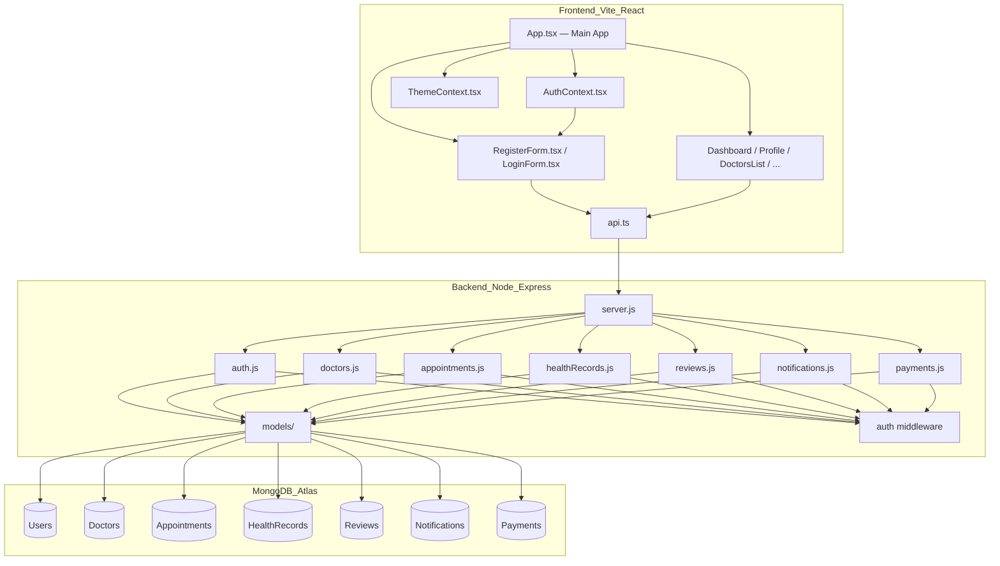

# Project Architecture Diagram 

```mermaid

graph TD

  subgraph Frontend_Vite_React
    direction LR
    FE_App["App.tsx — Main App"]
    FE_AuthCtx["AuthContext.tsx"]
    FE_Forms["RegisterForm.tsx / LoginForm.tsx"]
    FE_Pages["Dashboard / Profile / DoctorsList / ..."]
    FE_API["api.ts"]
    FE_Theme["ThemeContext.tsx"]

    FE_App --> FE_AuthCtx
    FE_App --> FE_Theme
    FE_App --> FE_Forms
    FE_App --> FE_Pages
    FE_AuthCtx --> FE_Forms
    FE_Forms --> FE_API
    FE_Pages --> FE_API
  end

  subgraph Backend_Node_Express
    direction LR
    BE_Entry["server.js"]
    BE_AuthR["auth.js"]
    BE_DocR["doctors.js"]
    BE_ApptR["appointments.js"]
    BE_HrR["healthRecords.js"]
    BE_RevR["reviews.js"]
    BE_NotifR["notifications.js"]
    BE_PayR["payments.js"]
    BE_Models["models/"]
    BE_AuthMW["auth middleware"]

    BE_Entry --> BE_AuthR
    BE_Entry --> BE_DocR
    BE_Entry --> BE_ApptR
    BE_Entry --> BE_HrR
    BE_Entry --> BE_RevR
    BE_Entry --> BE_NotifR
    BE_Entry --> BE_PayR

    BE_AuthR --> BE_Models
    BE_DocR --> BE_Models
    BE_ApptR --> BE_Models
    BE_HrR --> BE_Models
    BE_RevR --> BE_Models
    BE_NotifR --> BE_Models
    BE_PayR --> BE_Models

    BE_AuthR --> BE_AuthMW
    BE_DocR --> BE_AuthMW
    BE_ApptR --> BE_AuthMW
    BE_HrR --> BE_AuthMW
    BE_RevR --> BE_AuthMW
    BE_NotifR --> BE_AuthMW
    BE_PayR --> BE_AuthMW
  end

  subgraph MongoDB_Atlas
    direction LR
    DB_Users[(Users)]
    DB_Docs[(Doctors)]
    DB_Appts[(Appointments)]
    DB_Hr[(HealthRecords)]
    DB_Revs[(Reviews)]
    DB_Notifs[(Notifications)]
    DB_Pays[(Payments)]
  end

  FE_API --> BE_Entry

  BE_Models --> DB_Users
  BE_Models --> DB_Docs
  BE_Models --> DB_Appts
  BE_Models --> DB_Hr
  BE_Models --> DB_Revs
  BE_Models --> DB_Notifs
  BE_Models --> DB_Pays

```
