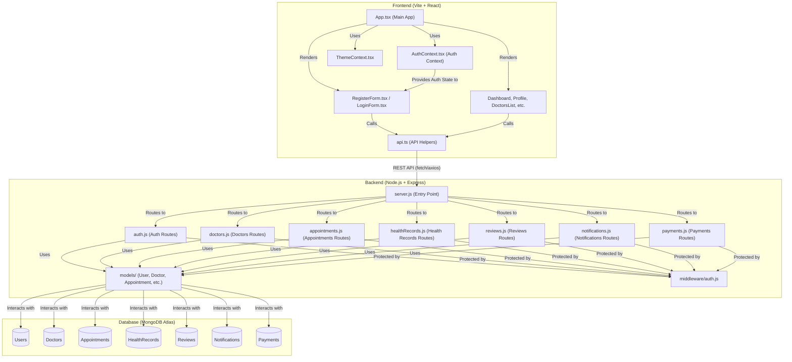

```mermaid
graph TD
  subgraph "Frontend (Vite + React)"
    direction LR
    A1["App.tsx (Main App)"]
    A2["AuthContext.tsx (Auth Context)"]
    A3["RegisterForm.tsx / LoginForm.tsx"]
    A4["Dashboard, Profile, DoctorsList, etc."]
    A5["api.ts (API Helpers)"]
    A6["ThemeContext.tsx"]

    A1 -- Uses --> A2
    A1 -- Renders --> A3
    A1 -- Renders --> A4
    A1 -- Uses --> A6
    A2 -- Provides Auth State to --> A3
    A3 -- Calls --> A5
    A4 -- Calls --> A5
  end

  subgraph "Backend (Node.js + Express)"
    direction LR
    B1["server.js (Entry Point)"]
    B2["auth.js (Auth Routes)"]
    B3["doctors.js (Doctors Routes)"]
    B4["appointments.js (Appointments Routes)"]
    B5["healthRecords.js (Health Records Routes)"]
    B6["reviews.js (Reviews Routes)"]
    B7["notifications.js (Notifications Routes)"]
    B8["payments.js (Payments Routes)"]
    B9["models/ (User, Doctor, Appointment, etc.)"]
    B10["middleware/auth.js"]

    B1 -- Routes to --> B2
    B1 -- Routes to --> B3
    B1 -- Routes to --> B4
    B1 -- Routes to --> B5
    B1 -- Routes to --> B6
    B1 -- Routes to --> B7
    B1 -- Routes to --> B8

    B2 -- Uses --> B9
    B3 -- Uses --> B9
    B4 -- Uses --> B9
    B5 -- Uses --> B9
    B6 -- Uses --> B9
    B7 -- Uses --> B9
    B8 -- Uses --> B9

    B2 -- Protected by --> B10
    B3 -- Protected by --> B10
    B4 -- Protected by --> B10
    B5 -- Protected by --> B10
    B6 -- Protected by --> B10
    B7 -- Protected by --> B10
    B8 -- Protected by --> B10
  end

  subgraph "Database (MongoDB Atlas)"
    direction LR
    C1[(Users)]
    C2[(Doctors)]
    C3[(Appointments)]
    C4[(HealthRecords)]
    C5[(Reviews)]
    C6[(Notifications)]
    C7[(Payments)]
  end

  %% Interactions
  A5 -- REST API (fetch/axios) --> B1
  B9 -- Interacts with --> C1
  B9 -- Interacts with --> C2
  B9 -- Interacts with --> C3
  B9 -- Interacts with --> C4
  B9 -- Interacts with --> C5
  B9 -- Interacts with --> C6
  B9 -- Interacts with --> C7
```
